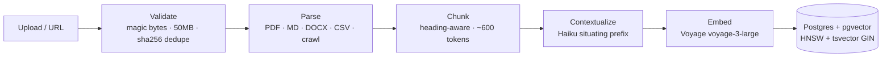
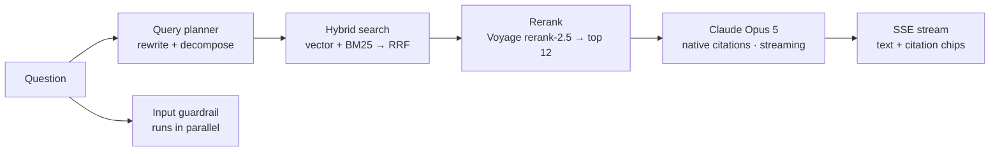

# 📚 Knowledge Base Bot (KB-Chat)

**Turn your documents into a chatbot that actually knows the answer — and proves it.**

Upload PDFs, Markdown, Word docs, CSVs, or crawl your help-doc sites, then ask questions in plain language. KB-Chat retrieves the right passages — *even when the answer is scattered across multiple pages or documents* — and streams back a grounded answer with **clickable citations** that open the exact source passage.


---

## ✨ Features

- **Multi-hop answers** — questions whose answer spans several documents get a single synthesized reply citing every source used
- **Native citations** — powered by Claude's citations API: numbered chips inline, click to open a source viewer with the exact passage highlighted
- **Serious retrieval** — hybrid search (dense vectors **+** BM25 full-text) fused with Reciprocal Rank Fusion, then reranked; query rewriting + decomposition for complex questions
- **Contextual Retrieval** — each chunk is embedded with an LLM-generated situating prefix ([Anthropic's technique](https://www.anthropic.com/news/contextual-retrieval)) for markedly better recall
- **Any source** — PDF, Markdown, TXT, DOCX, CSV uploads, plus sitemap-aware website crawling (Firecrawl)
- **LLM guardrails** — prompt-injection detection on input, untrusted-document isolation, groundedness checks on output, per-user rate limits
- **Built-in quality lab** — a golden-set eval harness (retrieval recall, faithfulness, citation accuracy via LLM-as-judge) with CI gates; thumbs-down feedback can be promoted into permanent regression tests
- **Admin dashboard** — ingestion health with one-click retry, guardrail flag review with retrieval debug, token/cost tracking, feedback triage
- **Honest ops UX** — live staged ingestion status (parsing → chunking → embedding → ready), provider rate-limits surfaced as "Rate limited", not a scary "Failed"

## 🏗 How it works

**Ingestion** (background worker, staged per document):



**Answering a question:**



Retrieved document content is treated as **untrusted data**: it enters the model as document blocks in the user turn — never the system prompt — and in-document instructions are inert content, not commands.

## 🧰 Tech stack

| Layer | Choice | Why |
|---|---|---|
| Web | Next.js 16 (App Router) + React 19 + Tailwind v4 + shadcn/ui | One TypeScript codebase, streaming-friendly |
| Database | Postgres 17 + pgvector — one DB for app data, vectors **and** the job queue | Hybrid search in a single SQL query; zero sync problems |
| ORM / jobs | Drizzle ORM · pg-boss worker | Typed schema with a raw-SQL escape hatch; queue with retries, no extra infra |
| Generation | Anthropic `claude-opus-5` (streaming, native citations, prompt caching) | Best-in-class multi-document synthesis; citations without string parsing |
| Cheap LLM tasks | `claude-haiku-4-5` | Query planning, chunk contextualization, guardrail classification |
| Embeddings / rerank | Voyage `voyage-3-large` (1024-dim) · `rerank-2.5` | Top retrieval quality, one vendor for both |
| Crawling / parsing | Firecrawl · unpdf · mammoth · remark · papaparse | Managed JS-rendered crawling; pure-TS parsers |
| Auth | Better Auth (email/password + optional Google OAuth) | Modern, minimal, domain-restriction hook built in |

## 🚀 Getting started

### Prerequisites

- **Node.js 24+**
- **Postgres 17 with pgvector** — any one of:
  - [Neon](https://neon.tech) free tier (zero install — copy the connection string) ← easiest
  - Docker: `docker compose up db` (uses `pgvector/pgvector:pg17`)
  - Homebrew: `brew install postgresql@17 pgvector`

### API keys

| Key | Get it at | Free? | Powers |
|---|---|---|---|
| `ANTHROPIC_API_KEY` | [console.anthropic.com](https://console.anthropic.com) | Pay-as-you-go (~$0.05–0.15/question) | Answers, query planning, guardrails, contextualization |
| `VOYAGE_API_KEY` | [dashboard.voyageai.com](https://dashboard.voyageai.com) | ✅ 200M free tokens | Embeddings + reranking |
| `FIRECRAWL_API_KEY` | [firecrawl.dev](https://firecrawl.dev) | ✅ 1,000 pages/month | URL crawling (optional — skip if you only upload files) |

### Setup

```bash
git clone https://github.com/RamanR09/Knowledge_Base_Bot.git
cd Knowledge_Base_Bot
npm install

cp .env.example .env
# Fill in: DATABASE_URL, BETTER_AUTH_SECRET (openssl rand -base64 32), and the API keys above

npm run db:migrate      # creates all tables (incl. the pgvector extension)
```

### Run

```bash
npm run dev             # terminal 1 — web app     → http://localhost:3000
npm run worker          # terminal 2 — ingestion worker (required for uploads to process)
```

Sign up, create a collection, drop in a document, wait for the **Ready** badge, and ask it something.

> **No Anthropic key yet?** On machines with [Claude Code](https://claude.com/claude-code) installed, chat falls back to a **dev-only CLI bridge** (`src/lib/llm/claudeCli.ts`) that answers via your Claude subscription — slower, no citation chips (sources are referenced inline), clearly labeled in the UI. Setting `ANTHROPIC_API_KEY` switches to the full native-citations path automatically. Do not rely on the bridge in production.

## 🖱 Using the app

1. **Documents** → create a collection → drag in files or **Add URL** (single page or full-site crawl)
2. Watch the staged status live: `pending → parsing → chunking → embedding → ready`
3. **Chat** → ask questions; answers stream in with numbered citation chips
4. Click a chip → **source viewer** opens with the cited passage highlighted, heading breadcrumb, and page numbers
5. 👍/👎 any answer — admins can promote a 👎 into a permanent eval regression test
6. **Admin** (role `admin`): ingestion health + retries, guardrail flags with retrieval debug, per-day token/cost, feedback triage

## ⚙️ Configuration

| Variable | Required | Description |
|---|---|---|
| `DATABASE_URL` | ✅ | Postgres connection string (pgvector required) |
| `BETTER_AUTH_SECRET` | ✅ | Session secret — `openssl rand -base64 32` |
| `BETTER_AUTH_URL` | — | App origin (default `http://localhost:3000`) |
| `ANTHROPIC_API_KEY` | prod ✅ | Claude API key (dev CLI-bridge fallback without it) |
| `VOYAGE_API_KEY` | ✅ | Embeddings + reranking |
| `FIRECRAWL_API_KEY` | — | Only needed for URL ingestion |
| `GOOGLE_CLIENT_ID` / `GOOGLE_CLIENT_SECRET` | — | Enables "Continue with Google" |
| `GOOGLE_ALLOWED_DOMAIN` | — | When set, **all** sign-ups are restricted to this email domain |
| `UPLOAD_DIR` | — | File storage path (default `./data/uploads`) |

## 📜 Scripts

| Command | What it does |
|---|---|
| `npm run dev` / `npm run worker` | Web app / ingestion worker |
| `npm run db:generate` / `db:migrate` | Drizzle migration workflow |
| `npm run test` | Unit tests (117, fully offline) |
| `npm run test:integration` | Real Postgres+pgvector via testcontainers (needs Docker; skips cleanly without) |
| `npm run test:e2e` | Playwright journey (needs running app + DB) |
| `npm run eval` | RAG quality harness (see below) |
| `npm run lint` / `typecheck` | ESLint / `tsc --noEmit` |

## 🔬 Testing & quality

Four layers, wired into CI (`.github/workflows/ci.yml`):

1. **Unit** (Vitest) — chunker boundaries, citation mapping, guardrail patterns, validators
2. **Integration** (testcontainers) — real migrations, the actual hybrid-search SQL against seeded vectors, pg-boss lifecycle
3. **E2E** (Playwright) — signup → upload → chat → citation click → feedback
4. **Eval harness** — 25 golden Q&A cases (single-hop, multi-hop across documents, adversarial injection) run through the *real* pipeline, scored on retrieval recall@12, faithfulness & relevance (LLM-as-judge), and citation accuracy. **Gates: recall ≥ 0.8, faithfulness ≥ 0.9.** Reports land in `evals/reports/`.

## 📁 Project structure

```
├── src/
│   ├── app/            # Next.js routes: (auth), (app) chat/documents/admin, api/*
│   ├── components/     # chat/ documents/ admin/ auth/ + shadcn ui/
│   ├── db/             # Drizzle schema (single source of truth) + migrations
│   ├── lib/
│   │   ├── ingestion/  # validate → parse → chunk → contextualize → embed
│   │   ├── rag/        # queryPlanner → retrieve (RRF SQL) → rerank → generate → chat
│   │   ├── guardrails/ # input gate · output gate · injection patterns
│   │   └── llm/        # Anthropic + Voyage clients · versioned prompt registry
│   └── workers/        # pg-boss job handlers
├── evals/              # golden.yaml · judges · fixture corpus · runner
├── tests/              # unit / integration / e2e
└── docs/               # PRD · ARCHITECTURE · USER_FLOWS · DESIGN_SYSTEM · TEST_PLAN
```

Deep dives: [PRD](docs/PRD.md) · [Architecture](docs/ARCHITECTURE.md) (with decision log) · [User flows](docs/USER_FLOWS.md) · [Design system](docs/DESIGN_SYSTEM.md) · [Test plan](docs/TEST_PLAN.md)

## 🔐 Security notes

- Document content is **untrusted**: isolated to the data channel, zero-width/bidi characters stripped at ingest, injection-suspect chunks flagged
- Input gate (heuristics + LLM classifier, fail-open) and deterministic output gate (secret-leak regexes, citation-coverage check)
- Upload validation by magic bytes (not extension), randomized filenames outside the web root, authenticated file serving
- Per-user rate limits (20 chat/min, 30 uploads/hr) · all provider keys server-side only · zod-validated env at boot

## 🚢 Deployment

The production profile runs everything on one machine:

```bash
docker compose --profile production up    # app + worker + db
```

> Serverless platforms (e.g. Vercel) need extra work: the pg-boss worker requires an always-on process and uploads need object storage. See `docs/ARCHITECTURE.md`.

## 🗺 Roadmap

- Embeddable chat widget for external sites · scanned-PDF OCR (Claude native PDF) · multi-tenant workspaces & billing · production groundedness sampling · S3/object storage backend

---

*No open-source license is currently granted — all rights reserved. Open an issue if you'd like to use this beyond reading the code.*
