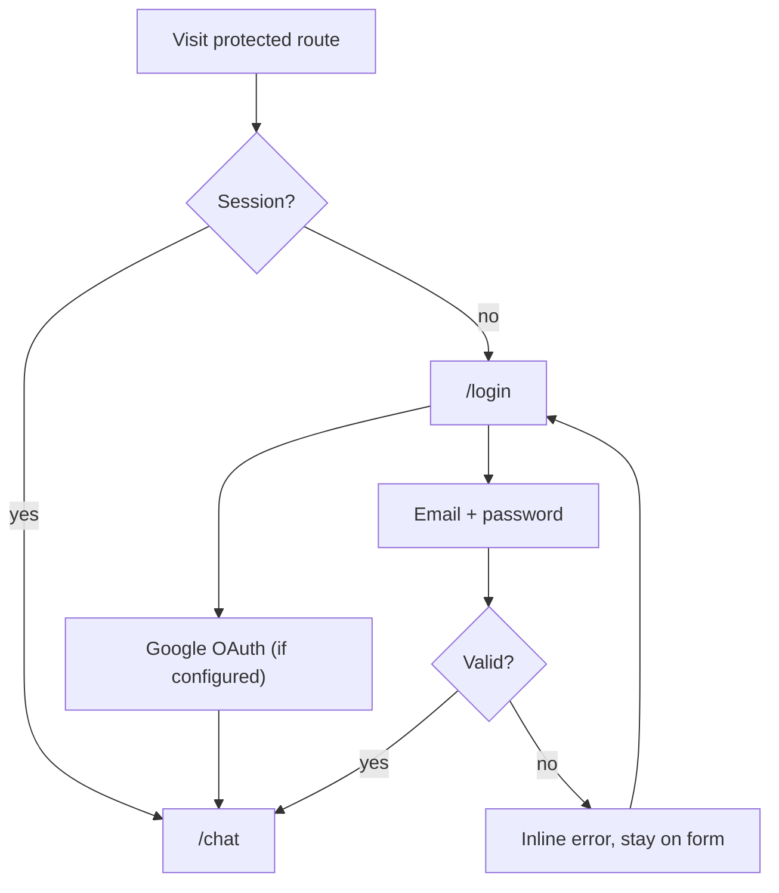
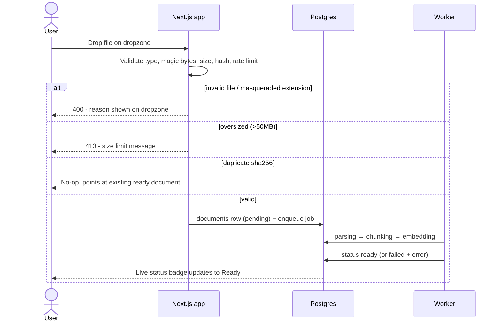
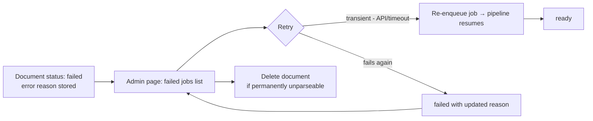

# KB-Chat — User Flows

Requirements: [PRD.md](./PRD.md) · Technical design: [ARCHITECTURE.md](./ARCHITECTURE.md) · UI: [DESIGN_SYSTEM.md](./DESIGN_SYSTEM.md)

## A. Sign up / sign in

1. Visitor hits any `(app)` route → redirected to `/login`.
2. Chooses email/password (sign up or sign in; min password length 10) **or** Google OAuth (enabled only when the Google env keys are set). When `GOOGLE_ALLOWED_DOMAIN` is set, all new sign-ups are restricted to that email domain.
3. Better Auth creates/validates the session → redirect to `/chat`.



## B. Upload document → staged status → ready

1. User drops a file on the dropzone (documents page).
2. Server validates: extension allowlist (PDF/MD/TXT/DOCX/CSV), magic bytes must match extension, ≤50MB, sha256 dedupe, upload rate limit (30/hr).
3. Document row created (`pending`), file stored under uuid name outside web root, pg-boss job enqueued.
4. Worker walks the staged pipeline; documents page polls/streams live status: `pending → parsing → chunking → embedding → ready`.



**Edge:** any stage error → `failed` with stored reason → flow F (admin retry).

## C. Crawl URL

1. User submits a URL (docs-site root) on the documents page.
2. Server validates URL + rate limit, enqueues a `crawlUrl` job.
3. Worker calls Firecrawl (sitemap-aware, same-origin, up to 50 pages) → clean markdown per page → the submitted document becomes the root page; every other discovered page gets its own document row and runs the same chunk → contextualize → embed flow. Per-page failures don't sink the crawl.
4. Pages appear in the documents list with individual statuses.

**Edge branches:**

| Edge | Behavior |
|---|---|
| Crawl blocked (robots/403/timeout) | Job → `failed` with Firecrawl error; visible to admin for retry |
| Partially crawled site | Successful pages become ready docs; failures listed per-page |
| Already-ingested page (same URL hash within the collection) | De-duped, no re-ingestion |

## D. Ask question → streamed answer → citation → source viewer

```mermaid
sequenceDiagram
  actor U as User
  participant App as Chat route (SSE)
  participant G as Guardrails
  participant R as RAG pipeline
  U->>App: Ask question
  App->>G: Input gate (parallel with planning)
  alt flagged as injection / abuse
    G-->>U: Refusal message; flag logged
  else rate limited (>20 chat/min)
    App-->>U: 429 with retry hint
  else clean
    App->>R: plan → hybrid search → rerank → generate
    alt answer found in KB
      R-->>U: SSE stream: text + citation chips inline
      U->>App: Click citation chip
      App-->>U: Source viewer opens at cited chunk/page
    else out of knowledge base
      R-->>U: Explicit "not in the knowledge base" - no citations fabricated
    end
  end
```

Multi-hop questions: planner emits 1–3 sub-queries; the answer cites every document used. Follow-ups resolve pronouns via the standalone rewrite (last 20 messages of history).

## E. Thumbs-down feedback → admin promotes to eval case

1. User clicks thumbs-down on an answer (optional comment) → `feedback` row linked to the message.
2. Admin page lists recent negative feedback with question, answer, and retrieval debug.
3. Admin clicks **Promote to eval case** → question + expected behavior written to `eval_cases`.
4. The case persists to `eval_cases`. **Gap:** the harness currently executes only `golden.yaml` cases, so promoted cases aren't run yet — see [TEST_PLAN.md](./TEST_PLAN.md).

## F. Failed ingestion → admin retry



pg-boss retries with backoff automatically (2 retries) before a document lands as `failed`; the manual escalation path is `POST /api/documents/{id}/retry` (only failed documents are retryable).

## Error/edge summary

| Edge | Where | User-visible behavior |
|---|---|---|
| Invalid / masqueraded file | Upload (B) | 400 with reason; magic-byte mismatch called out |
| Oversized file (>50MB) | Upload (B) | 413 size-limit message on dropzone |
| Duplicate document | Upload (B) | No-op; existing doc referenced |
| Crawl blocked | Crawl (C) | Failed job with crawler error; admin retry |
| Rate limited | Chat (20/min) / uploads (30/hr) | 429 + retry hint |
| Out-of-KB question | Chat (D) | Explicit "not in the knowledge base" answer |
| Prompt injection (query or in-doc) | Guardrails | Refusal + `guardrail_flags` log; in-doc instructions reported, never followed |
| Ingestion stage failure | Worker | `failed` status + reason → admin retry (F) |
